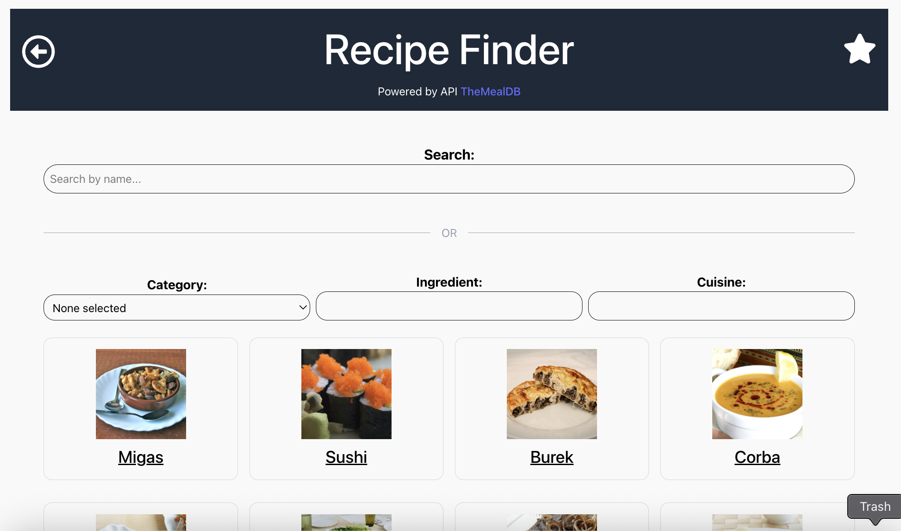
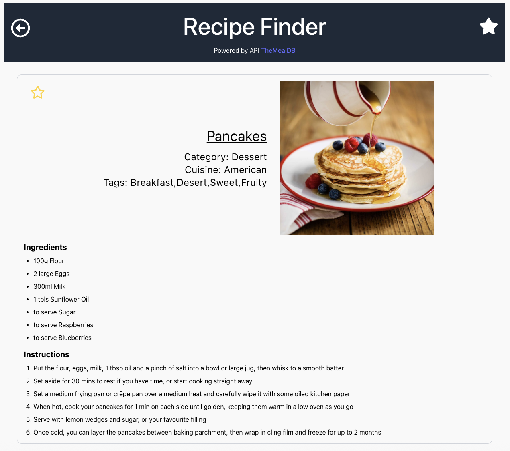

# 🍽️ Recipe Finder

A modern recipe search app built with **React**, **TypeScript**, **Vite**, and **Tailwind CSS**.
Deployed on **Vercel**  
Powered by [TheMealDB API](https://www.themealdb.com/).

## Features

- 🔍 **Search Recipes:** Search for meals by name.
- 🗂️ **Filter Recipes:** Filter by category, ingredient, or cuisine. (this is or logic, not and)
- ⭐ **Favorites:** Mark recipes as favorites and view them later.
- 📄 **Recipe Details:** View full recipe details, instructions and list of ingredients.
- ⚡ **Fast & Responsive:** Built with Vite, React Query, and Tailwind CSS for a smooth user experience.
- 🔗 **Routing:** Uses React Router v6 for navigation between pages.

## Screenshots




## Deployment

Demo can be found here: https://recipe-finder-bay-chi.vercel.app/recipes

## Getting Started Locally

### Prerequisites

- [Node.js](https://nodejs.org/) (v18+ recommended)
- [npm](https://www.npmjs.com/)

### Installation and Running the App

```bash
npm install
```

```bash
npm run dev
```

Open [http://localhost:5173](http://localhost:5173) in your browser.

## Project Structure

```
src/
  app/           # App router and main layout
  components/    # Reusable UI components
  hooks/         # Custom React hooks (API queries, favorites)
  pages/         # Page components (Recipes, RecipeDetail, Favorites)
  types/         # TypeScript types
  styles/        # Tailwind and global styles
```

## Credits

- [TheMealDB](https://www.themealdb.com/) for the free meal API and images.
- [React Query](https://tanstack.com/query/latest) for data fetching.
- [Tailwind CSS](https://tailwindcss.com/) for styling.

---

MIT License
